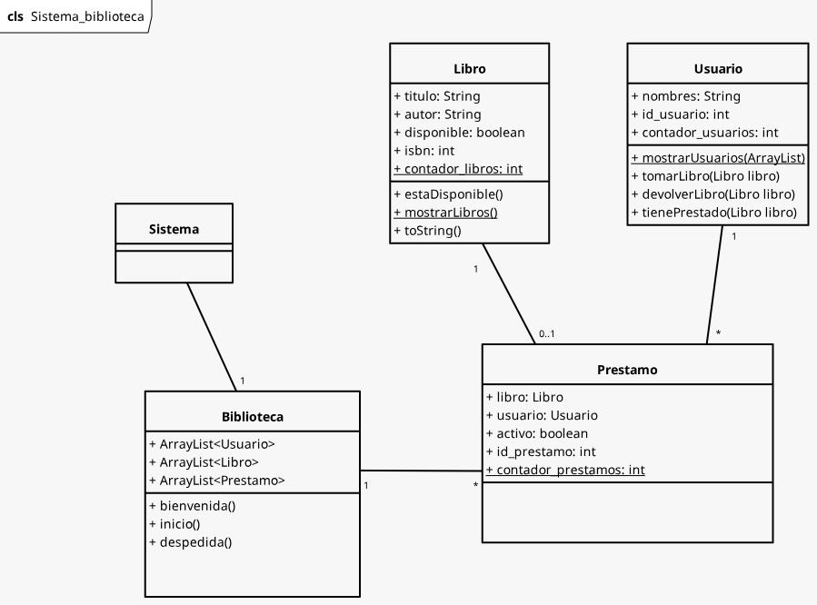

# Sistema Biblioteca
**Integrantes:**
- Achiri Cuevas Daniel Cooper
- Bernal Neyra Sebastian Colem
- Cavero Ale Leonardo Ismael
- Huanca Lupaca Jhoans Anthony

Este en nuestro codigo grupal del Laboratorio 04 del curso de Desarrollo de Software Orientado a Objetos.

### Diagrama UML:

### SOLUCIÓN DEL CUESTIONARIO:
1. Explica, con tus propias palabras, los conceptos principales que aplicaste en esta
práctica y cómo se relacionan con el tema del curso.

En esta práctica aplicamos conceptos como encapsulación, abstracción, relaciones entre objetos y ArrayList. Estos conceptos fundamentales clave en el desarrollo de software orientado a objetos, permitiendo estructurar programas de una manera reutilizable.
También diseñamos un diagrama UML antes de empezar a programar para tener claro lo que íbamos a hacer.

2. Describe los principales problemas o dificultades que encontraste durante el desarrollo de los ejercicios y cómo los resolviste.

Durante el desarrollo del sistema de biblioteca encontramos dificultades principales como el manejo de las clases con ArrayList, gestión de relaciones entre objetos, y diseñar un buen menú. Resolvimos estos problemas implementando contadores estáticos para códigos únicos, métodos de validación con expresiones regulares y usando for-each, y dividimos algunas funcionalidades en métodos más pequeños para simplificar la lógica de cálculos.

  3. Menciona al menos una posible mejora o extensión que podría aplicarse al programa que desarrollaste en este laboratorio.
  
  Una mejora podría ser mejorar la experiencia del usuario al usar palabras más comprensibles, otra mejora puede ser mejorar la estructura en las clases para que el código sea mas legible

### Pagina Unsa
[UNSA](https://www.unsa.edu.pe/)

